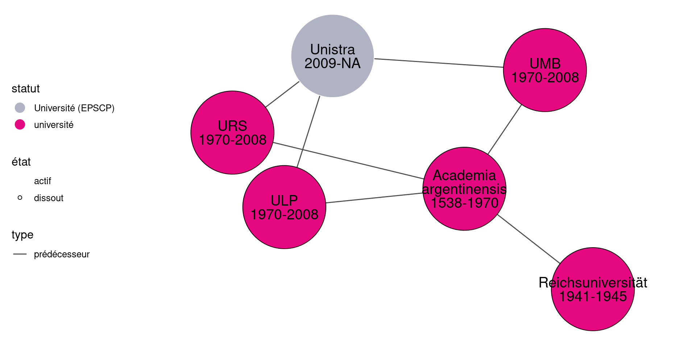
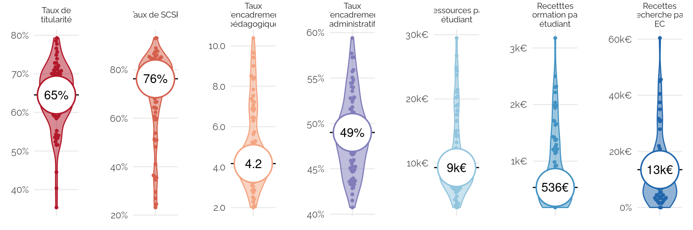
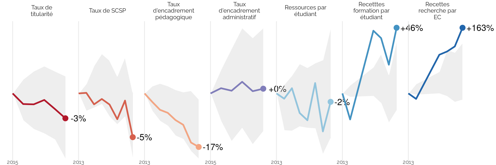
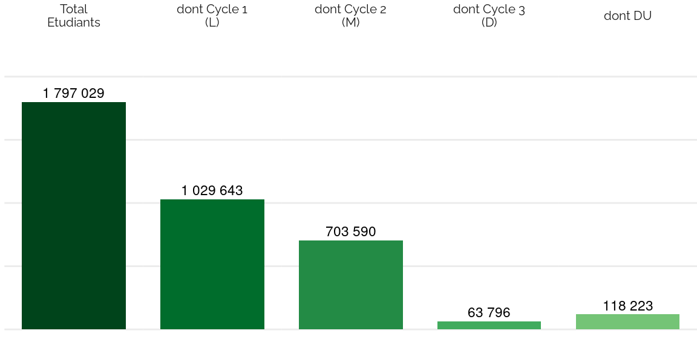
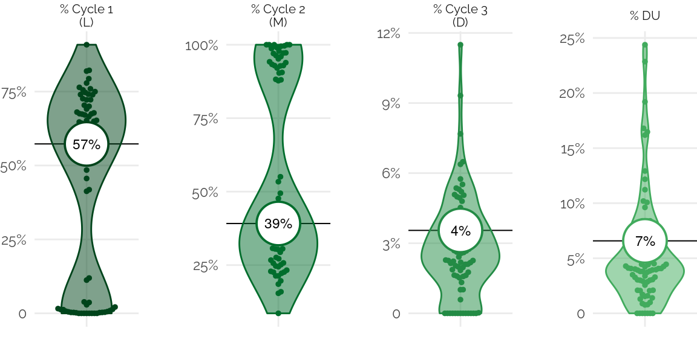

Tableau de bord ESR
================
Julien Gossa
Mai 2020

***ATTENTION : Les informations présentées dans ce document sont issues
de traitements entièrement automatisés. Leur validité dépend de la
validité de ces traitements, comme de la validité des données
sources.***

Téléchargement des tableaux de bord :

  - [Edition 2017-2018](./tdbesr-rapport-2017.pdf)
  - [Edition 2018-2019](./tdbesr-rapport.pdf)

## Avant-propos

Apparaissant dès le XIIIe siècle, les universités sont des organisations
à la durée de vie particulièrement longue. Leur évolution est permanente
et se fait sous différentes tensions, notamment sociales et politiques,
culturelles et cultuelles, ou encore démographiques et géographique, qui
touchent à la profession même des universitaires. Depuis le tournant du
XXIe siècle, un mouvement de profonde transformation de l’Enseignement
supérieur et rechercher (ESR) est engagé :

  - La Loi liberté et responsabilités des universités (LRU) amorce en
    2007 un mouvement dit d’« autonomie des universités », adossé
    notamment aux responsabilités et compétences élargies (RCE), qui
    transfèrent la masse salariale du ministère aux établissements. Les
    universités sont ainsi invitées à développer leur propre politique
    d’emploi.
  - Onze universités sont sélectionnées pour l’Initiative d’excellence
    (IDEX) sur un projet de gouvernance différenciant dans le cadre du
    Plan d’investissement d’avenir (PIA).
  - Un nombre exceptionnel de fusions et regroupements est organisé,
    d’abord autour des Pôles de recherche et d’enseignement supérieur
    (PRES) puis des Communautés d’universités et d’établissements
    (COMUE).

Ces transformations conduisent à des évolutions structurelles locales
qui favorisent les divergences entre les établissements de l’ESR. Ces
divergences se retrouvent à tous les niveaux de détail, par exemple dans
le pyramidage LMD de l’effectif étudiant, et le pyramidage PR-MCF-2d
degré de l’effectif enseignant. Il existe donc un besoin nouveau et
croissant d’outils de suivi et d’analyse des caractéristiques et
politiques des établissements de l’ESR.

Ce document propose donc une sélection d’indicateurs primaires
suffisament peu nombreux et complexes pour être rapidement utilisables,
puis une construction d’indicateurs clés permettant de leur donner du
sens.

## Présentation des données

Il existe trois sources principales d’informations sur les
établissements de l’ESR français :

  - [data.gouv.fr](https://www.data.gouv.fr/fr/) : le portail des
    données publiques du gouvernement français ;
  - [\#DataESR](https://data.esr.gouv.fr/FR/) : le portail des données
    publiques du ministère de l’enseignement supérieur, de la recherche
    et de l’innovation ;
  - [WikiData](https://www.wikidata.org/wiki/Wikidata:Main_Page) : une
    base de connaissances libre et gratuite, dans la famille WikiMédia,
    qui compte notamment WikiPédia.

Les deux premières sources sont maintenues par des organes officiels, et
proposent essentiellement des jeux de données brutes, très complets et
généralement fiables. En revanche, leur délais de publication peut être
élevé (autour de 18 mois), et ils sont structurellement rigides (il
s’agit seulement de tableaux).

WikiData s’appuie sur l’édition collaborative, plus adaté au rythme des
transformations actuelles, et permet de structurer les données de façon
très souple, grâce à un très large choix de relations entre entités. En
revanche, les données sont peu fiables, souvent incomplètes, et
non-harmonisées.

Ce travail s’appuie à la fois sur ces deux types de données : WikiData
pour décrire les organisations, et les données gouvernementales pour les
indicateurs de performance.

# Description des organisations

Les descriptions d’organisation sont de trois ordres, pour chaque
établissement :

  - le diagramme de filiation modélise ses origines ;
  - le diagramme d’association modélise ses relations externes, avec
    d’autres organismes ;
  - le diagramme de composition modélise ses relations internes, avec
    ses composantes et
laboratoires.

## Exemples de lectures

### Diagramme de filiation

Exemple de lecture : « L’Université de Strasbourg (Unistra) a été créée
en 2009, par la fusion des universités Louis Pasteur, Robert Schuman et
Marc-Bloch. Ces trois universités ont été créées en 1970, par la
division de l’Université de Strasbourg (Académia argentinensis), dont
les origines remontent à 1528.
»

### Diagramme d’association

Exemple de lecture : « L’Université de Strasbourg (Unistra) est inclue
dans le Site Alsacien. Elle est membre de la LERU, de la CURIF, de
l’EUA, du Réseau d’Utrecht, de COUPERIN et de RENATER. Elle est
également lauréate de
l’IDEX»

### Diagramme de composition

Exemple de lecture : « L’Université de Strasbourg (Unistra) a de
nombreuses composantes. »

## Edition collaborative

Ces diagrammes dépendent d’une édition collaborative. En conséquence,
ils peuvent comporter des informations fausses, mais plus généralement
incomplètes et non uniformes.

Ce document fait partie d’un effort d’harmonisation de ces données,
grâce à une modélisation décrite dans [ce
guide](https://github.com/cpesr/wikidataESR/blob/master/Rmd/wikidataESR.md).
Chaque tableau de bord comporte un lien permettant de modifier
directement les informations sur WikiData.

Le lecteur est invité à le faire chaque fois qu’il le jugera nécessaire,
et les modifications seront automatiquement incluse dans la prochaine
version de ce document.

# Indicateurs de performance

Dans ce travail, les indicateurs retenus sont de trois ordres :
effectifs étudiants, effectifs enseignants et données financières. Il
n’existe malheureusement pas de données ouvertes sur les personnels
administratifs.

Ces indicateurs sont déclinés en deux types :

  - les indicateurs primaires, secondaires et normalisés, au plus proche
    des jeux de données ouvertes ;
  - les indicateurs clés de performance, combinaison des précédents plus
    proche des missions.

## Les indicateurs primaires, secondaires et normalisés

Les indicateurs primaires et secondaires sont ceux qui sont directement
disponibles dans les jeux de données. L’indicateur primaire est le plus
général possible. Les indicateurs secondaires sont plus précis, et
peuvent se recouper (i.e. la somme des indicateurs secondaires ne
correspond pas à l’indicateur principal).

Leur présentation est en deux volets. Le premier présente les valeurs
brutes, avec en première colonne l’indicateur primaire, et ensuite les
indicateurs secondaires.

Le second volet présente les valeurs normalisées, qui sont calculées
comme le rapport entre les indicateurs secondaires et l’indicateur
primaire. L’avantage principal de ces valeurs relatives est d’être
comparables d’un établissement à l’autre. On peut donc présenter la
moyenne de tous les établissements et leur distribution, afin d’y situer
chaque établissement.

Les indicateurs primaires suivant sont extraits des jeux de données
ouverts :

  - [Principaux établissements d’enseignement supérieur
    (lien)](https://data.enseignementsup-recherche.gouv.fr/explore/dataset/fr-esr-principaux-etablissements-enseignement-superieur/)
      - **UAI** : Unité Administrative Immatriculée
      - **Libellé** et **Sigle**
      - **Type** : université, regroupement ou autre
      - **Type détaillé** : type d’établissement tel qu’il apparait dans
        le jeu de données
      - **Académie**
      - **Rattachement** : établissement de rattachement (regroupement
        et fusions)
      - **Site web**, url **wikidata** et **légifrance**
  - [Indicateurs financiers des opérateurs de l’enseignement supérieur
    français
    (lien)](https://data.enseignementsup-recherche.gouv.fr/explore/dataset/fr-esr-operateurs-indicateurs-financiers/)
      - **Ressources** : *Produits encaissables* dans le jeu de données
      - **Masse salariale** : *Dépenses de personnel* dans le jeu de
        données
      - **Ressources propres** : *Ressources propres / Produits
        encaissables* dans le jeu de données
  - [Statistiques sur les effectifs d’étudiants inscrits par
    établissement public sous tutelle du ministère en charge de
    l’Enseignement supérieur
    (lien)](https://data.enseignementsup-recherche.gouv.fr/explore/dataset/fr-esr-statistiques-sur-les-effectifs-d-etudiants-inscrits-par-etablissement/)
      - **Effectif étudiant** : Nombre d’étudiants inscrits
        (inscriptions principales) hors étudiants inscrits en parallèle
        en CPGE
      - **Nombre d’inscriptions en Cycle 1 (L)** hors étudiants inscrits
        en parallèle en CPGE, inclu les DUT et autres formations
        post-bac
      - **Nombre d’inscriptions en Cycle 2 (M)**
      - **Nombre d’inscriptions en Cycle D (D)**
      - **Nombre d’inscriptions en diplôme d’établissement** : par
        exemple diplôme d’université (DU)
  - [Les enseignants titulaires dans les établissements publics de
    l’enseignement supérieur
    (lien)](https://data.enseignementsup-recherche.gouv.fr/explore/dataset/fr-esr-enseignants-titulaires-esr-public/)
  - [Les enseignants non permanents des établissements publics de
    l’enseignement supérieur
    (lien)](https://data.enseignementsup-recherche.gouv.fr/explore/dataset/fr-esr-enseignants-nonpermanents-esr-public/)
      - **Effectif enseignant** : les vacataires ne sont pas
        comptablisés et les quotités ne sont pas prises en compte
      - **Effectif titulaire**
      - **Enseignant-chercheurs titulaires**
      - **Doctorants et ATER**
      - **Contrats
LRU**

<!-- - [APB Voeux de poursuite d'étude et admissions (lien)](https://data.enseignementsup-recherche.gouv.fr/explore/dataset/fr-esr-apb_voeux-et-admissions/) -->

<!-- - [Parcoursup vœux de poursuite d'études et de réorientation dans l'enseignement supérieur et réponses des établissements (lien)](https://data.enseignementsup-recherche.gouv.fr/explore/dataset/fr-esr-parcoursup/) -->

<!--    - __Formations Post-Bac__ : le nombre de formations post-bac proposées par l'établissement -->

<!--    - __Sélectives__ : le nombre de formations dont le rang du dernier appelé est inférieur de plus de 10% du nombre de candidats -->

<!--    - __Hyper-sélectives__ : le nombre de formations dont le rang du dernier appelé est inférieur de plus de 80% du nombre de candidats -->

<!--    - __Surchargées__ : le nombre de formations dont le nombre d'admis est supérieur à la capacité d'accueil -->

<!--    - __Souschargées__ : le nombre de formations dont le nombre d'admis est inférieur à 75% de la capacité d'accueil -->

<!-- _NB_ : les données APB/Parcoursup sont particulièrement difficile à exploiter et comportent de nombreux trous. De plus, elles concernent deux plateformes différentes (APB puis Parcoursup), avec des changements legislatifs et pratiques profonds. Les indicateurs ont ne sont pas présentés dans cette version pour éviter d'induire le lecteur en erreur. -->

<!-- Enfin, afin de pouvoir présenter les données, les series ont été décalées d'un an (i.e. les données d'admission post-bac notée à l'année 2017 sont celles de la rentrée 2018). -->

## Les indicateurs clés de performance (KPI)

Sur la base des indicateurs primaires, des indicateurs clés peuvent être
consruits pour représenter des informations plus proches des missions,
et donc plus à même de faire sens. Quatre indicateurs clés sont
présentés dans le cadre de ce travail :

  - **Taux de ressources propres** : ce pourcentage des ressources qui
    ne proviennent pas de l’Etat permet de mesurer l’autonomie financère
    de l’établissement vis-à-vis de se tutelle principale. *Attention* :
    ce gain d’autonomie peut être compensée par une perte d’autonomie
    vis-à-vis d’autres acteurs.
  - **Taux de ressources par étudiant** : ce rapport entre les
    ressources de l’établissement et le nombre d’étudiants inscrits en
    premier et deuxième cycle (L et M) permet de mesurer les ressources
    dont dispose l’établissement par rapport à la taille de sa
    population étudiante. *Attention* : ce taux ne correspond pas à la
    dépense de l’établissement pour chacun de ses étudiants \[1\].
  - **Taux d’encadrement** : ce nombre d’enseignants titulaires pour 100
    étudiants inscrits en premier et deuxième cycle (L et M) permet de
    mesurer à la fois la qualité de l’encadrement, et la charge des
    enseignants. *Attention* : la répartition de cette charge peut être
    très hétérogène au sein même d’un établissement, tant entre les
    enseignants qu’entre les étudiants.
  - **Taux de titularité** : pourcentage d’enseignants titulaires parmis
    tous les enseignants. *Attention* : il existe une population
    d’enseignants non titulaires « normale » \[2\], ce n’est donc pas
    une mesure directe de la précarité enseignante.

Les indicateurs clés de performances sont présentés sous trois formes :

  - Normalisés : les valeurs de la dernière année sont présentées en
    fonction de la moyenne nationale des établissements de même type ;
  - Evolution en valeur absolue : les valeurs sont présentées sur
    plusieurs années ;
  - Evolution en valeur de référence : les valeurs sont présentées en
    pourcentage relatif à l’année de référence.

Pour chacune des trois présentations, le fond de graphique représente
les valeurs de tous les autres établissements, sous forme de point (un
point par établissement), de [boite à
moustaches](https://fr.wikipedia.org/wiki/Bo%C3%AEte_%C3%A0_moustaches),
ou de distribution en
violon.

## Exemples de lecture

### KPI : normalisés

Exemple de lecture : « Le taux de titularité de cet établissement est de
3,7, pour une moyenne nationale de 4,1.
».

### KPI : évolution en valeur absolue

Exemple de lecture : « En 2012, le taux d’encadrement de l’établissement
était à 4,3, soit la médiane pour toutes les universités. Il est
progressivement passé à 3,7, ce qui place maintenant l’établissement
dans le deuxième quartile
».

### KPI : évolution en valeur de référence

Exemple de lecture : « Entre 2012 et 2017, le taux d’encadrement de
l’établissement a baissé d’environ 15%, ce qui le place dans le
premier quartile inférieur des évolution de cet indicateur
».

### Données brutes

Exemple de lecture : « l’établissement compte 47 573 étudiants hors
double inscription en CPGE, dont 26 679 en 1er cycle (L, DUT, prépa,
etc.)
».

### Données normalisées

Exemple de lecture : « La part moyenne des étudiants en 1er cycle dans
les effectifs des universités est de 68%. L’établissement présente une
part de 56%, ce qui le place dans le quartile inférieur ».

1.  les dépenses sont multiples, et un établissement « riche » peut très
    bien consacrer son budget à d’autres fonction que l’enseignement. La
    comptabilité analytique interne aux établissements permet
    d’approcher une valeur de la dépense par étudiant, mais elle est
    généralement très peu fiable (Gossa, 2019)

2.  Par exemple : doctorants et ATER, ou les vacataires professionnels
    qui ne relèvent pas d’une politique de précarisation
