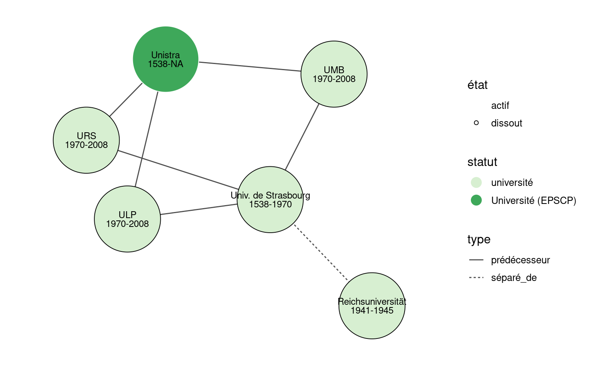

Tableau de bord ESR
================
Julien Gossa
2022-10-17

***ATTENTION : Les informations présentées dans ce document sont issues
de traitements entièrement automatisés. Leur validité dépend de la
validité de ces traitements, comme de la validité des données
sources.***

Téléchargement des tableaux de bord :

-   [Edition 2020-2021](./tdbesr-rapport.pdf)

## Avant-propos

Apparaissant dès le XIIIe siècle, les universités sont des organisations
à la durée de vie particulièrement longue. Leur évolution est permanente
et se fait sous différentes tensions, notamment sociales et politiques,
culturelles et cultuelles, ou encore démographiques et géographique, qui
touchent à la profession même des universitaires. Depuis le tournant du
XXIe siècle, un mouvement de profonde transformation de l’Enseignement
supérieur et rechercher (ESR) est engagé :

-   La création de l’Agence Nationale de la Recherche (ANR) en 2005
    transforme les modalités d’allocation des moyens aux établissement,
    et celle de l’Agence d’évaluation de la recherche et de
    l’enseignement supérieur (AÉRES) en 2006, remplacée par le Haut
    Conseil de l’évaluation de la recherche et de l’enseignement
    supérieur (Hcéres) en 2013, modifie leurs modalités d’évaluation.
-   La Loi liberté et responsabilités des universités (LRU) amorce en
    2007 un mouvement dit d’« autonomie des universités », adossé
    notamment aux responsabilités et compétences élargies (RCE), qui
    transfèrent la masse salariale du ministère aux établissements. Les
    universités sont ainsi invitées à développer leur propre politique
    d’emploi.
-   Onze universités sont sélectionnées pour l’Initiative d’excellence
    (IDEX) sur un projet de gouvernance différenciant dans le cadre du
    Plan d’investissement d’avenir (PIA).
-   Un nombre exceptionnel de fusions et regroupements est organisé,
    d’abord autour des Pôles de recherche et d’enseignement supérieur
    (PRES) puis des Communautés d’universités et d’établissements
    (COMUE). Ces regroupements se poursuivent jusqu’à ce jour.

Ces transformations conduisent à des évolutions structurelles locales
visant à favoriser les divergences entre les établissements de l’ESR,
qui peuvent se retrouver à tous les niveaux de détail, par exemple dans
le pyramidage LMD de l’effectif étudiant, comme dans le pyramidage
PR-MCF-2d degré de l’effectif enseignant.

Ces transformations créent ainsi un besoin nouveau et croissant d’outils
de suivi et d’analyse des caractéristiques et politiques des
établissements de l’ESR. Ce document propose donc une sélection
d’indicateurs primaires suffisamment peu nombreux et complexes pour être
rapidement utilisables, ainsi qu’une construction d’indicateurs clés
permettant de leur donner du sens.

### Quelques informations principales

Les données présentées dans ce document ne concernent que les personnels
et étudiants du Ministère de l’enseignement supérieure, de la recherche
et de l’innovation. 1,8 millions d’étudiants y sont recensés, pour près
de 3 millions d’étudiants en tout. **Entre 2013 et 2020, le nombre de
ces étudiants à cru de 19%**, en particulier en premier cycle (+24%) et
sauf en doctorat (-8%). Dans le même temps, **les effectifs enseignants
n’ont cru que de 3%, conduisant à une chute du taux d’encadrement
pédagogique de -17%**.

Les données recensent aussi plus de 98 000 personnels d’enseignement et
de recherche (E-EC) et 95 000 personnels BIATS. Entre 2015 et 2020, **le
taux de titularité de ces personnels a baissé de -3%**, particulièrement
en raison des politiques RH des universités (-4%). Si le nombre
d’enseignants titulaires a légèrement baissé (-2%) et celui des
personnels BIATSS titulaires légèrement augmenté (+1%), cette dynamique
s’explique surtout par **un plus grand recours aux contractuels,
particulièrement pour l’enseignement (+17% de doctorants et ATER, +14%
d’E-EC contractuels, hors vacataires)**. Cette dynamique est encore plus
marquée dans les universités (respectivement +22% et +25%).

Une partie de cette dynamique s’explique par les transformations du
système de financement, dont les données montrent la ventilation de
presque 18 Md€ : l’augmentation des subventions pour charge de service
public (SCSP) (depuis 2013, +11%, et +8% pour les universités) reste
très inférieure à l’augmentation du nombre d’étudiants. En revanche,
**les recettes propres sont en pleine augmentation (depuis 2013, +72%
pour la formation, atteignant pratiquement 1 Md€, et +156% pour la
recherche à 815 M€)**. Ces recettes, issues des droits d’inscription, de
la formation continue et des différents appels à projets, ne permettent
légalement pas de rémunérer des fonctionnaires.

Au sein des universités, les situations et dynamiques peuvent être très
différentes, avec par exemple des taux de SCSP allant de moins de 53% à
plus de 93%, et **des recettes propres formation (de 150€ à 2200€ par
étudiant en moyenne) et recherche (de 192€ à 85k€ par
enseignant-chercheur en moyenne)**. On retrouve la même diversité pour
les taux de titularité (de 53% à 80%), les taux d’encadrement
pédagogique (de 2 à 6 enseignants pour 100 étudiants), les taux
d’encadrement administratif (de 37% à 57% des personnels sont BIATSS).

Si l’on prend en compte les autres type d’établissements du MESRI, alors
ces disparités sont encore plus importantes, exigeants des
représentations exhaustives.

## Sources des données

Il existe trois sources principales d’informations sur les
établissements de l’ESR français :

-   [data.gouv.fr](https://www.data.gouv.fr/fr/) : le portail des
    données publiques du gouvernement français ;
-   [\#DataESR](https://data.enseignementsup-recherche.gouv.fr/pages/home/)
    : le portail des données publiques du ministère de l’enseignement
    supérieur, de la recherche et de l’innovation ;
-   [WikiData](https://www.wikidata.org/wiki/Wikidata:Main_Page) : une
    base de connaissances libre et gratuite, dans la famille Wikimédia,
    qui compte notamment Wikipédia.

Les deux premières sources sont maintenues par des organes officiels, et
proposent essentiellement des jeux de données brutes, très complets et
généralement fiables. Cependant, ils sont structurellement rigides (il
s’agit seulement de tableaux), et ne visent pas à capturer les *soft
data*, comme l’histoire des organisations ou leurs compositions. Ce
document utilisent les jeux de données suivants[^1] :

-   [fr-esr-statistiques-sur-les-effectifs-d-etudiants-inscrits-par-etablissement](https://data.enseignementsup-recherche.gouv.fr/explore/dataset/fr-esr-statistiques-sur-les-effectifs-d-etudiants-inscrits-par-etablissement)
-   [fr-esr-personnels-biatss-etablissements-publics](https://data.enseignementsup-recherche.gouv.fr/explore/dataset/fr-esr-personnels-biatss-etablissements-publics)
-   [fr-esr-enseignants-titulaires-esr-public](https://data.enseignementsup-recherche.gouv.fr/explore/dataset/fr-esr-enseignants-titulaires-esr-public/)
-   [fr-esr-enseignants-nonpermanents-esr-public](https://data.enseignementsup-recherche.gouv.fr/explore/dataset/fr-esr-enseignants-nonpermanents-esr-public/information/)
-   [fr-esr-operateurs-indicateurs-financiers](https://data.enseignementsup-recherche.gouv.fr/explore/dataset/fr-esr-operateurs-indicateurs-financiers/information/)
-   [fr-esr-principaux-etablissements-enseignement-superieur](https://data.enseignementsup-recherche.gouv.fr/explore/dataset/fr-esr-principaux-etablissements-enseignement-superieur/information/?disjunctive.type_d_etablissement)

Wikidata s’appuie sur l’édition collaborative, plus adaptée à ce type
d’information, en permettant de structurer les données de façon très
souple, grâce à un très large choix de relations entre entités. En
revanche, les données sont peu fiables, souvent incomplètes, et
non-harmonisées.

Ce travail s’appuie sur ces deux bases de données : Wikidata pour
décrire les organisations, et les données gouvernementales pour les
indicateurs de performance.

***ATTENTION : Les informations présentées dans ce document sont issues
de traitements entièrement automatisés. Leur validité dépend de la
validité de ces traitements, comme de la validité des données
sources.***

**Observations et suggestions sont bienvenues dans cette
[interface](https://github.com/cpesr/tdbESR-rapport/issues).**

## Données sur les organisations

Les descriptions d’organisation sont de trois ordres, pour chaque
établissement :

-   le diagramme de filiation modélise ses origines ;
-   le diagramme d’association modélise ses relations externes, avec
    d’autres organismes ;
-   le diagramme de composition modélise ses relations internes, avec
    ses composantes et laboratoires.

Dans ces diagrammes :

-   les nœuds cerclés sont actifs, alors que les autres sont dissouts ;
-   les couleurs dépendent des types d’établissement ;
-   les types de traits dépendent des relations entre les nœuds.

Pour des raisons de lisibilité, les légendes ne sont pas
systématiquement inclues dans les tableaux de bord.

### Edition collaborative

Ces diagrammes dépendent d’une édition collaborative. En conséquence,
ils peuvent comporter des informations fausses, mais plus généralement
incomplètes et non uniformes.

Ce document fait partie d’un effort d’harmonisation de ces données,
grâce à une modélisation décrite dans [ce
guide](https://github.com/cpesr/wikidataESR/blob/master/Rmd/wikidataESR.md).
Chaque tableau de bord comporte un lien permettant de modifier
directement les informations sur WikiData.

Le lecteur est invité à le faire chaque fois qu’il le jugera nécessaire,
et les modifications seront automatiquement incluse dans la prochaine
version de ce document.

### Exemples de lectures

#### Diagramme de filiation

Exemple de lecture : « L’Université de Strasbourg (Unistra) a été créée
en 2009, par la fusion des universités Louis Pasteur, Robert Schuman et
Marc-Bloch. Ces trois universités ont été créées en 1970, par la
division de l’Université de Strasbourg (Académia argentinensis), dont
les origines remontent à 1528. »

#### Diagramme d’association

Exemple de lecture : « L’Université de Strasbourg (Unistra) est inclue
dans le Site Alsacien. Elle est membre de la LERU, de la CURIF, de
l’EUA, du Réseau d’Utrecht, de COUPERIN et de RENATER. Elle est
également lauréate de l’IDEX»

#### Diagramme de composition

Exemple de lecture : « L’Université de Strasbourg (Unistra) a de
nombreuses composantes. »

## Données sur les performances

Dans ce travail, les indicateurs retenus sont de quatre ordres :
effectifs étudiants, effectifs BIATSS, effectifs enseignants et données
financières.

Ces indicateurs sont déclinés en deux types :

-   **Les indicateurs primaires et secondaires** : au plus proche des
    jeux de données ouvertes, ils présentent les effectifs étudiants et
    personnels, ainsi que les finances.
    -   Premier dans les listes, l’indicateur primaire est le plus
        global possible.
    -   Seconds dans les listes, les indicateurs secondaires sont plus
        précis, et peuvent se recouper (i.e. la somme des indicateurs
        secondaires ne correspond pas à l’indicateur principal).
-   **Les indicateurs clés de performance** : combinaisons des
    précédents, plus représentatives des missions.

### Dictionnaire des données

-   **Rentrée** : rentrée universitaire
-   **UAI** : Unité Administrative Immatriculée
-   **Libellé** : libellé de l’établissement
-   **Sigle** : nom court ou sigle de l’établissement
-   **Groupe** : ensemble d’établissements comparables, à gros grain
-   **Groupe détaillé** : ensemble d’établissements
-   **Académie** : académie de l’établissement
-   **Rattachement** : établissement de rattachement
-   **Site web** : adresse du site web de l’établissement
-   **wikidata** : adresse wikidata des données de l’établissement
-   **légifrance** : adresse du texte de loi créant l’établissement

#### Effectifs étudiants

-   **Etudiants** : Effectif total étudiant (Hors double inscription
    CPGE)
-   **Cycle 1 (L)** : Effectif étudiant inscrit en premier cycle (L,
    DUT, etc.)
-   **Cycle 2 (M)** : Effectif étudiant inscrit en deuxième cycle (M)
-   **Cycle 3 (D)** : Effectif étudiant inscrit en troisième cycle
    (Doctorat, HDR)
-   **DU** : Effectif étudiant inscrit en diplôme d’établissement (DU,
    non-national)

#### Personnels d’enseignement et de rechercher

-   **Enseignants** : Effectif total enseignant
-   **Titulaires** : Effectif titulaire
-   **EC** : Effectif enseignant-chercheur
-   **Doc et ATER** : Effectif doctorant et ATER
-   **Autres contractuels** : Effectif autres contractuels

#### Personnels BIATSS

-   **BIATSS** : Effectif total BIATSS
-   **Titulaires** : Effectif BIATSS titulaires
-   **A** : Effectif BIATSS catégorie A
-   **B** : Effectif BIATSS catégorie B
-   **C** : Effectif BIATSS catégorie C

#### Indicateurs financiers

-   **Ressources** : Ressources totales (produits encaissables)
-   **Masse salariale** : Masse salariale (dépenses de personnels)
-   **SCSP** : Subvention pour charge de service public (dotation d’Etat
    directe)
-   **Recettes formation** : Droits d’inscription, Diplôme
    d’établissement, Formation continue, VAE et Taxe d’apprentissage
-   **Recettes recherche** : Valorisation, ANR en et hors investissement
    d’avenir, contrats et prestations de recherche

#### Indicateurs clés de performance

-   **Taux de titularité** : Part des titulaires dans les personnels
-   **Taux de SCSP** : Part des Subventions pour charge de service
    public (SCSP) dans les ressources
-   **Taux d’encadrement pédagogique** : Nombre d’enseignants
    (titulaires et contractuels, hors doctorants et vacataires) pour 100
    étudiants en cycles 1 et 2
-   **Taux d’encadrement administratif** : Part des personnels BIATSS
    dans les personnels
-   **Ressources par étudiant** : Ressources divisées par le nombre
    d’étudiants
-   **Recettes formation par étudiant** : Recettes formation divisées
    par le nombre d’étudiants
-   **Recettes recherche par EC** : Recettes recherche divisées par le
    nombre d’enseignants-chercheurs (titulaires et contractuels)

### Représentations et exemples de lecture

Trois représentations sont utilisées dans ce document :

-   **Valeurs absolues** : permettant de connaitre les valeurs à la
    dernière année ;
-   **Evolutions normalisées** : permettant de percevoir l’évolution
    dans le temps, en valeur 100 pour une année de référence ;
-   **Valeurs normalisées** : permettant connaitre un rapport et de le
    comparer aux autres établissements.

Les exemples suivants utilisent l’ensemble des établissements dans le
périmètre du MESRI.

### Valeurs absolues

Les valeurs absolues sont représentées en colonne, avec en première
colonne l’indicateur primaire, et ensuite les indicateurs secondaires.

Exemple de lecture : « Les données recensent 1,8 millions d’étudiants,
dont 1,1 million en premier cycle (Licence) ».

### Evolution normalisées

Les évolutions normalisées sont calculées en valeur 100 pour une rentrée
de référence.

-   la courbe colorée concerne l’établissement ou le groupe ;
-   deux courbes grises concernent l’ensemble et le groupe ;
-   l’aire grise en fond concerne la moitié des établissements du
    groupe.

Exemple de lecture : « Les données recensent une augmentation de 19% de
tous les étudiants, et de 24% en premier cycle (Licence) ».

### Valeurs normalisées

Les valeurs normalisées sont calculées comme le rapport entre les
indicateurs secondaires et l’indicateur primaire. L’avantage principal
de ces rapport est d’être comparables d’un établissement à l’autre.

-   Le disque central contient la valeur propre à l’établissement ou au
    groupe ;
-   chaque point correspond à un établissement du groupe ;
-   le violon représente la distribution des établissements du groupe ;
-   une ou deux lignes horizontales représentent les valeurs de
    l’ensemble et du groupe.

Exemple de lecture : « Le taux d’encadrement pédagogique global est de
4,2 enseignants pour 100 étudiants, et peut varier de 2 à plus de 10
selon les établissements, et même au delà ».

NB : Pour des raisons de pertinence, des établissements hors-normes sont
exclus des représentations. Par exemple, certains taux d’encadrement
montent à plus de 100 dans des établissements de recherche inscrivants
très peu d’étudiants.

[^1]: Méthodologie et sources des traitements sont disponible à cette
    adresse : <https://github.com/cpesr/kpiESR>
