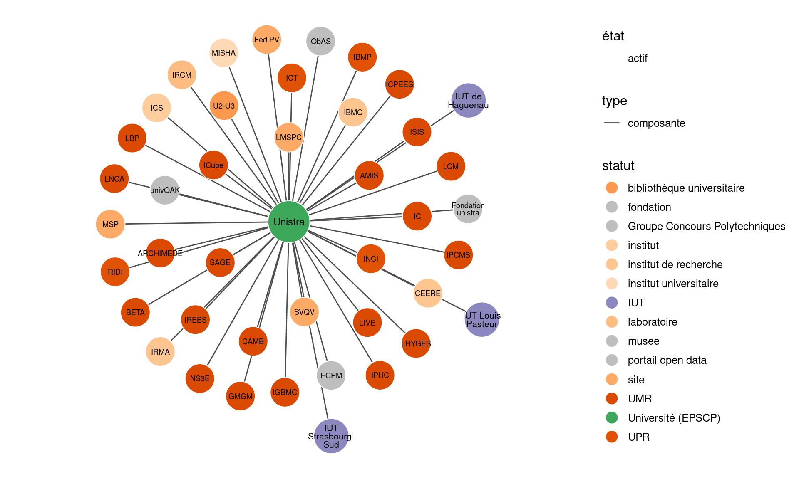

Tableau de bord ESR
================
Julien Gossa
2023-11-12

***ATTENTION : Les informations présentées dans ce document sont issues
de traitements entièrement automatisés. Leur validité dépend de la
validité de ces traitements, comme de la validité des données
sources.***

Téléchargement des tableaux de bord :

- [Edition 2020-2021](./tdbesr-rapport.pdf)

## Avant-propos

Apparaissant dès le XIIIe siècle, les universités sont des
organisations à la durée de vie particulièrement longue. Elles évoluent
en permanence, sous différentes tensions, notamment sociales et
politiques, culturelles et cultuelles, ou encore démographiques et
géographique. Au tournant du XXIe siècle, un nouveau mouvement de
profonde transformation de l’Enseignement supérieur et rechercher (ESR)
est engagé :

- La création de **l’Agence Nationale de la Recherche (ANR) en 2005**
  transforme les modalités d’allocation des moyens aux établissement, et
  celle de l’Agence d’évaluation de la recherche et de l’enseignement
  supérieur (AÉRES) en 2006, remplacée par **le Haut Conseil de
  l’évaluation de la recherche et de l’enseignement supérieur (Hcéres)
  en 2013**, modifie leurs modalités d’évaluation.
- **La Loi liberté et responsabilités des universités (LRU) amorce en
  2007** un mouvement dit d’« autonomie des universités », adossé
  notamment aux responsabilités et compétences élargies (RCE), qui
  transfèrent la masse salariale du ministère aux établissements. Les
  universités sont ainsi invitées à développer leur propre politique
  d’emploi.
- Onze universités sont sélectionnées pour l’Initiative d’excellence
  (IDEX) sur un projet de gouvernance différenciant dans le cadre du
  Plan d’investissement d’avenir (PIA).
- **Un nombre exceptionnel de fusions et regroupements** est organisé,
  d’abord autour des Pôles de recherche et d’enseignement supérieur
  (PRES) puis des Communautés d’universités et d’établissements (COMUE).
  Ces regroupements se poursuivent.
- En plus de la CPU (Conférence des présidents d’université), les
  présidences créent deux organisations : l’AUREF (Alliance des
  Universités Recherche et Formation) et la CURIF (Coordination des
  universités de recherche intensive françaises). La CURIF deviendra
  ensuite UDice, puis **la CPU deviendra FU (France Universités) en
  2022**.
- **La loi de programmation de la recherche (LPR ou LPPR, 2020)**
  accroît le financement de l’ANR, diminue le poids du CNU (Conseil
  National des Universités) sur les recrutements et promotions, crée une
  nouvelle voie d’accès au corps des professeurs et modifie les contrats
  doctoraux et post-doctoraux.
- **RIFSEEP** (régime indemnitaire tenant compte des fonctions, des
  sujétions, de l’expertise et de l’engagement professionnel) et
  **RIPEC** (régime indemnitaire des personnels enseignants et
  chercheurs) transforment les modalités de rémunération des personnels,
  en mettant l’accent sur les performances individuelles et les
  évaluations locales.

Face à un début de stagnation éducative, la formation supérieure est
tout autant réformée :

- **Le processus de Bologne amorce en 1998** un rapprochement des
  systèmes d’enseignement supérieur européens, notamment en visant une
  harmonisation sur le LMD (Licence-Master-Doctorat) et en introduisant
  les crédits ECTS (European Credit Transfer and Accumulation System).
- **La loi Orientation et Réussite des Etudiants (ORE, 2018)** introduit
  la plateforme Parcoursup et autorise les universités à sélectionner
  leurs étudiants, mais donne le contrôle des capacités d’accueil et des
  quotas aux rectorats.
- **Le baccalauréat général est profondément réformé** pour supprimer
  les trois filières S, ES et L, ce qui démultiplie les profils des
  étudiants.
- **Le DUT est supprimé** et remplacé par un bachelor destiné à
  accueillir plus de bacheliers technologiques.
- **Les études de santé sont profondément réformées**.
- **L’accès aux Masters est régulièrement modifié**, de la réduction du
  nombre de mentions en 2014, à la création d’un droit à la poursuite
  d’étude en 2017, jusqu’à la mise en œuvre de la plateforme nationale
  MonMaster en 2023.
- **La loi pour la liberté de choisir son avenir professionnel (2018)**
  dérégule les CFA (centres de formation d’apprentis). Une subvention
  exceptionnellement généreuse pour les employeurs fait exploser le
  nombre d’apprentis, transformant des formations publiques et
  encourageant un développement incontrôlé des formations privées.

Ces listes sont loin d’être exhaustives.

Ces transformations conduisent à des évolutions structurelles locales
visant à favoriser les divergences entre les établissements de l’ESR,
qui peuvent se retrouver à tous les niveaux de détail, comme par exemple
dans le pyramidage LMD de l’effectif étudiant, ou encore comme dans le
pyramidage PR-MCF-2d degré de l’effectif enseignant.

Il existe ainsi un besoin nouveau et croissant d’outils de suivi et
d’analyse des caractéristiques et politiques des établissements de
l’ESR. C’est pourquoi **ce document propose une sélection d’indicateurs
primaires suffisamment peu nombreux et complexes pour être rapidement
utilisables, ainsi qu’une construction d’indicateurs clés permettant de
leur donner du sens**.

### Quelques informations principales

Les données présentées dans ce document ne concernent que les personnels
et étudiants du Ministère de l’enseignement supérieure, de la recherche.

### Les étudiantes et étudiants

1,8 millions d’étudiants sont recensés, pour près de 3 millions
d’étudiants en tout.

- Pour la première fois depuis 15 ans, les effectifs étudiants sont en
  baisse, en raison notamment de la démographie, et peut-être également
  en raison d’une régulation post-COVID.
- **Entre 2013 et 2021, le nombre de ces étudiants à cru de 14%**, en
  particulier en premier cycle (+15%) et sauf en doctorat (-8%).
- Dans le même temps, **les effectifs enseignants n’ont cru que de 4%,
  conduisant à une chute du taux d’encadrement pédagogique de -13%**.
- Le nombre d’inscription en diplôme d’établissement (DE ou DU) a cru de
  +16%.

### Les personnels

Les données recensent aussi près de 99 600 personnels d’enseignement et
de recherche (E-EC) et près de 96 000 personnels BIATS. Entre 2015 et
2021 :

- **le taux de titularité de ces personnels a baissé de -4%**,
  particulièrement en raison des politiques RH des universités.
- Le nombre d’enseignants titulaires continue sa baisse (-3%) et celui
  des personnels BIATSS titulaires la commence (-1%).
- Cette dynamique s’explique surtout par **un plus grand recours aux
  contractuels, particulièrement pour l’enseignement** (+22% de
  doctorants et ATER, +26% d’E-EC contractuels, hors vacataires, entre
  2013 et 2021).
- Cette contractualisation est encore plus marquée dans les universités
  (+27% et +39%).
- Parmi les personnels BIATSS, les effectifs de catégorie A et B
  augmentent (+26% et +13%), alors que ceux de C diminuent (-19%).

### Les finances

Une partie de la dynamique des recrutements s’explique par les
transformations du système de financement, dont les données montrent la
ventilation de presque 18 Md€. Entre 2013 et 2021 :

- Les subventions pour charge de service public (SCSP) ont augmenté de
  +15% (+11% pour les universités), ce qui reste inférieur à
  l’augmentation du nombre d’étudiants et ne prend pas compte
  l’inflation.
- En revanche, **les recettes propres sont en pleine augmentation,
  atteignant 2,4Md€**, mais elles ne permettent légalement pas de
  rémunérer des fonctionnaires.
- Issues des droits d’inscription, de la formation continue, de
  l’apprentissage et de la VAE, **les recettes propres formation ont
  augmenté de +79%** (+72% pour les universités).
- Issues des des appels à projets, contrats et prestations, **les
  recettes propres recherche ont plus que triplé avec +241%** (+249%
  pour les universités).
- Dans le même temps, la masse salariale, qui représente le trois quart
  des dépenses, n’a cru que de 9% (8% dans les universités).

### Les universités

Au sein des universités, les situations et dynamiques peuvent être très
différentes.

- Les budgets par étudiant vont de 2,5k€ à 16k€, et des taux de SCSP de
  moins de 20% à plus de 95%.
- **Les recettes propres formation vont de 170€ à 2350€ par étudiant en
  moyenne, et celles recherche de 410€ à 81k€ par enseignant-chercheur
  en moyenne**.
- On retrouve la même diversité pour les taux de titularité (de 49% à
  77%), les taux d’encadrement pédagogique (de 2,1 à 6,6 enseignants
  pour 100 étudiants), ou encore les taux d’encadrement administratif
  (de 38% à 62% des personnels sont BIATSS).

Si l’on prend en compte les autres type d’établissements du MESRI, alors
ces disparités sont encore plus importantes, exigeants des
représentations exhaustives.

## Sources des données

Il existe trois sources principales d’informations sur les
établissements de l’ESR français :

- [data.gouv.fr](https://www.data.gouv.fr/fr/) : le portail des données
  publiques du gouvernement français ;
- [\#DataESR](https://data.enseignementsup-recherche.gouv.fr/pages/home/)
  : le portail des données publiques du ministère de l’enseignement
  supérieur, de la recherche et de l’innovation ;
- [WikiData](https://www.wikidata.org/wiki/Wikidata:Main_Page) : une
  base de connaissances libre et gratuite, dans la famille Wikimédia,
  qui compte notamment Wikipédia.

Les deux premières sources sont maintenues par des organes officiels, et
proposent essentiellement des jeux de données brutes, très complets et
généralement fiables. Cependant, ils sont structurellement rigides (il
s’agit uniquement de tableaux), et ne visent pas à capturer les *soft
data*, comme l’histoire des organisations ou leurs compositions.

Ce travail s’appuie sur ces deux bases de données : Wikidata pour
décrire les organisations, et les données gouvernementales pour les
indicateurs de performance.

### Sources de données ouvertes

Ce document utilisent les jeux de données suivants, maintenus et mis à
disposition par le
[SIES](https://www.enseignementsup-recherche.gouv.fr/fr/statistiques-et-analyses-50213)
:

- [fr-esr-statistiques-sur-les-effectifs-d-etudiants-inscrits-par-etablissement](https://data.enseignementsup-recherche.gouv.fr/explore/dataset/fr-esr-statistiques-sur-les-effectifs-d-etudiants-inscrits-par-etablissement)
- [fr-esr-personnels-biatss-etablissements-publics](https://data.enseignementsup-recherche.gouv.fr/explore/dataset/fr-esr-personnels-biatss-etablissements-publics)
- [fr-esr-enseignants-titulaires-esr-public](https://data.enseignementsup-recherche.gouv.fr/explore/dataset/fr-esr-enseignants-titulaires-esr-public/)
- [fr-esr-enseignants-nonpermanents-esr-public](https://data.enseignementsup-recherche.gouv.fr/explore/dataset/fr-esr-enseignants-nonpermanents-esr-public/information/)
- [fr-esr-operateurs-indicateurs-financiers](https://data.enseignementsup-recherche.gouv.fr/explore/dataset/fr-esr-operateurs-indicateurs-financiers/information/)
- [fr-esr-principaux-etablissements-enseignement-superieur](https://data.enseignementsup-recherche.gouv.fr/explore/dataset/fr-esr-principaux-etablissements-enseignement-superieur/information/?disjunctive.type_d_etablissement)

Ces différents jeux de données sont agrégées dans le projet
[kpiESR](https://github.com/cpesr/kpiESR).

Le compte rendu de la dernière mise à jour des données est disponible
[ici](https://github.com/cpesr/kpiESR/blob/master/maj-data.md).

### WikidataESR

Wikidata s’appuie sur l’édition collaborative, plus adaptée aux *soft
data*, en permettant de structurer les données de façon très souple,
grâce à un très large choix de relations entre entités. En revanche, les
données sont peu fiables, souvent incomplètes, et non-harmonisées.

Le projet [WikidataESR](https://github.com/cpesr/WikidataESR) propose
une harmonisation des informations sur l’organisation de l’enseignement
supérieur français disponibles publiquement sur la base de donnée
collaborative Wikidata.

### Méthodologie et traitements

#### Note sur les périodes de couverture temporelle

Les différents jeux de données agrégés présentent des périodes de
couverture temporelle très hétérogènes, commençant en 2006, 2009, 2010,
2015 et 2016, et terminant en 2020, 2021 et 2022. Chaque fois que cela
est possible, les périodes ont été harmonisées sur 2010-2020.

Au moment de la production de ce document, le jeu de données le plus
bloquant est celui des enseignants non permanents, qui termine en 2020,
ce qui empêche de présenter la période 2010-2021.

#### Codes sources

Méthodologie et codes sources des traitements sont disponibles à cette
adresse :

<https://github.com/cpesr/kpiESR>

***ATTENTION : Les informations présentées dans ce document sont issues
de traitements entièrement automatisés. Leur validité dépend de la
validité de ces traitements, comme de la validité des données
sources.***

**Observations et suggestions sont bienvenues dans cette
[interface](https://github.com/cpesr/tdbESR-rapport/issues).**

## Données sur les organisations

Les descriptions d’organisation sont de trois ordres, pour chaque
établissement :

- le diagramme de filiation modélise ses origines ;
- le diagramme d’association modélise ses relations externes, avec
  d’autres organismes ;
- le diagramme de composition modélise ses relations internes, avec ses
  composantes et laboratoires.

Dans ces diagrammes :

- les nœuds cerclés sont actifs, alors que les autres sont dissouts ;
- les couleurs dépendent des types d’établissement ;
- les types de traits dépendent des relations entre les nœuds.

Pour des raisons de lisibilité, les légendes ne sont pas
systématiquement inclues dans les tableaux de bord.

### Edition collaborative

Ces diagrammes dépendent d’une édition collaborative. En conséquence,
ils peuvent comporter des informations fausses, mais plus généralement
incomplètes et non uniformes.

Ce document fait partie d’un effort d’harmonisation de ces données,
grâce à une modélisation décrite dans [ce
guide](https://github.com/cpesr/wikidataESR/blob/master/Rmd/wikidataESR.md).
Chaque tableau de bord comporte un lien permettant de modifier
directement les informations sur WikiData.

Le lecteur est invité à le faire chaque fois qu’il le jugera nécessaire,
et les modifications seront automatiquement incluse dans la prochaine
version de ce document.

### Exemples de lectures

#### Diagramme de filiation

Exemple de lecture : « L’Université de Strasbourg (Unistra) a été créée
en 2009, par la fusion des universités Louis Pasteur, Robert Schuman et
Marc-Bloch. Ces trois universités ont été créées en 1970, par la
division de l’Université de Strasbourg (Académia argentinensis), dont
les origines remontent à 1528, et qui a connu une division entre 1941 et
1945. »

#### Diagramme d’association

Exemple de lecture : « L’Université de Strasbourg (Unistra) est inclue
dans le Site Alsacien. Elle est membre de la LERU, de la CURIF, de
l’EUA, du Réseau d’Utrecht, de COUPERIN et de RENATER. Elle est
également lauréate de l’IDEX»

#### Diagramme de composition

Exemple de lecture : « L’Université de Strasbourg (Unistra) a 3 IUTs. »

## Données sur les performances

Dans ce travail, les indicateurs retenus sont de quatre ordres :
effectifs étudiants, effectifs BIATSS, effectifs enseignants et données
financières.

Ces indicateurs sont déclinés en deux types :

- **Les indicateurs primaires et secondaires** : au plus proche des jeux
  de données ouvertes, ils présentent les effectifs étudiants et
  personnels, ainsi que les finances.
  - Premier dans les listes, l’indicateur primaire est le plus global
    possible.
  - Seconds dans les listes, les indicateurs secondaires sont plus
    précis, et peuvent se recouper (i.e. la somme des indicateurs
    secondaires ne correspond pas à l’indicateur principal).
- **Les indicateurs clés de performance** : combinaisons des précédents,
  plus représentatives des missions.

### Dictionnaire des données

- **Rentrée** : rentrée universitaire
- **UAI** : Unité Administrative Immatriculée
- **Libellé** : libellé de l’établissement
- **Sigle** : nom court ou sigle de l’établissement
- **Groupe** : ensemble d’établissements comparables, à gros grain
- **Groupe détaillé** : ensemble d’établissements
- **Académie** : académie de l’établissement
- **Rattachement** : établissement de rattachement
- **Site web** : adresse du site web de l’établissement
- **wikidata** : adresse wikidata des données de l’établissement
- **légifrance** : adresse du texte de loi créant l’établissement

#### Effectifs étudiants

- **Etudiants** : Effectif total étudiant (Hors double inscription CPGE)
- **Cycle 1 (L)** : Effectif étudiant inscrit en premier cycle (L, DUT,
  etc.)
- **Cycle 2 (M)** : Effectif étudiant inscrit en deuxième cycle (M)
- **Cycle 3 (D)** : Effectif étudiant inscrit en troisième cycle
  (Doctorat, HDR)
- **DU** : Effectif étudiant inscrit en diplôme d’établissement (DU,
  non-national)

#### Personnels d’enseignement et de rechercher

- **Enseignants** : Effectif total enseignant
- **Titulaires** : Effectif titulaire
- **EC** : Effectif enseignant-chercheur
- **Doc et ATER** : Effectif doctorant et ATER
- **Autres contractuels** : Effectif autres contractuels

#### Personnels BIATSS

- **BIATSS** : Effectif total BIATSS
- **Titulaires** : Effectif BIATSS titulaires
- **A** : Effectif BIATSS catégorie A
- **B** : Effectif BIATSS catégorie B
- **C** : Effectif BIATSS catégorie C

#### Indicateurs financiers

- **Ressources** : Ressources totales (produits encaissables)
- **Masse salariale** : Masse salariale (dépenses de personnels)
- **SCSP** : Subvention pour charge de service public (dotation d’Etat
  directe)
- **Recettes formation** : Droits d’inscription, Diplôme
  d’établissement, Formation continue, VAE et Taxe d’apprentissage
- **Recettes recherche** : Valorisation, ANR en et hors investissement
  d’avenir, contrats et prestations de recherche

#### Indicateurs clés de performance

- **Taux de titularité** : Part des titulaires dans les personnels
- **Taux de SCSP** : Part des Subventions pour charge de service public
  (SCSP) dans les ressources
- **Taux d’encadrement pédagogique** : Nombre d’enseignants (titulaires
  et contractuels, hors doctorants et vacataires) pour 100 étudiants en
  cycles 1 et 2
- **Taux d’encadrement administratif** : Part des personnels BIATSS dans
  les personnels
- **Ressources par étudiant** : Ressources divisées par le nombre
  d’étudiants
- **Recettes formation par étudiant** : Recettes formation divisées par
  le nombre d’étudiants
- **Recettes recherche par EC** : Recettes recherche divisées par le
  nombre d’enseignants-chercheurs (titulaires et contractuels)

### Représentations et exemples de lecture

Trois représentations sont utilisées dans ce document :

- **Valeurs absolues** : permettant de connaitre les valeurs à la
  dernière année ;
- **Evolutions normalisées** : permettant de percevoir l’évolution dans
  le temps, en valeur 100 pour une année de référence ;
- **Valeurs normalisées** : permettant connaitre un rapport et de le
  comparer aux autres établissements.

Les exemples suivants utilisent l’ensemble des établissements dans le
périmètre du MESRI.

### Valeurs absolues

Les valeurs absolues sont représentées en colonne, avec en première
colonne l’indicateur primaire, et ensuite les indicateurs secondaires.

Exemple de lecture : « Les données recensent 1,8 millions d’étudiants,
dont 1 million en premier cycle (Licence) ».

### Evolution normalisées

Les évolutions normalisées sont calculées en valeur 100 pour une rentrée
de référence.

- la courbe colorée concerne l’établissement ou le groupe ;
- deux courbes grises concernent l’ensemble et le groupe ;
- l’aire grise en fond concerne la moitié des établissements du groupe.

Exemple de lecture : « Les données recensent une augmentation de 14% de
tous les étudiants, et une baisse de 8% en troisième cycle (Doctorat) ».

### Valeurs normalisées

Les valeurs normalisées sont calculées comme le rapport entre les
indicateurs secondaires et l’indicateur primaire. L’avantage principal
de ces rapport est d’être comparables d’un établissement à l’autre.

- Le disque central contient la valeur propre à l’établissement ou au
  groupe ;
- chaque point correspond à un établissement du groupe ;
- le violon représente la distribution des établissements du groupe ;
- une ou deux lignes horizontales représentent les valeurs de l’ensemble
  et du groupe.

Exemple de lecture : « Le taux d’encadrement pédagogique global est de
4,2 enseignants pour 100 étudiants, et peut varier de 2 à plus de 10
selon les établissements, et même au delà ».

NB : Pour des raisons de pertinence, des établissements hors-normes sont
exclus des représentations. Par exemple, certains taux d’encadrement
montent à plus de 100 dans des établissements de recherche inscrivants
très peu d’étudiants.

### Tableaux de bord

Les différentes représentations mises ensemble constituent un tableau de
bord en deux volets, d’abord les indicateurs clés de performance, et
ensuite les données primaires.

